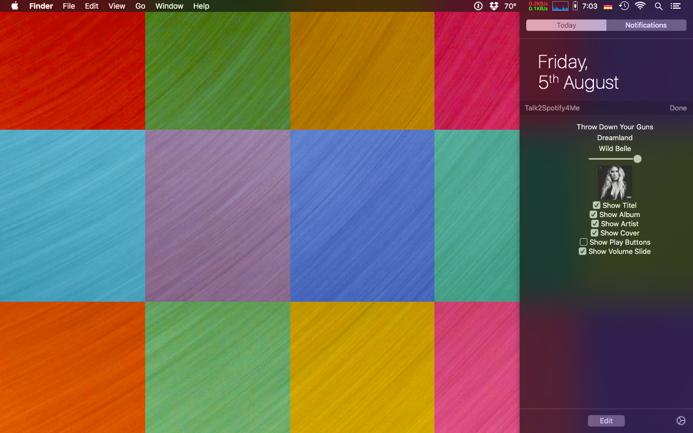

Talk2Spotify4Me
===============

Implements a Widget for Spotify in the Notification Center of OS X 10.11 El Capitan and newer.

It uses the AppleScript API for Spotify to get the necesseray information and control it.

Download the project, copy the "Talk2Spotify.app" to your Applications folder and start it. In the "Today View" settings the widget may still needs manually to be added.

If you update from an old version, make sure to delete the old version of the app and may restart the Mac if problems appear.

New in this version:
 - Covers are now also available for podcasts and local music.
 - Enabled the option area so that the user can decide which content he sees. (see figure below)

